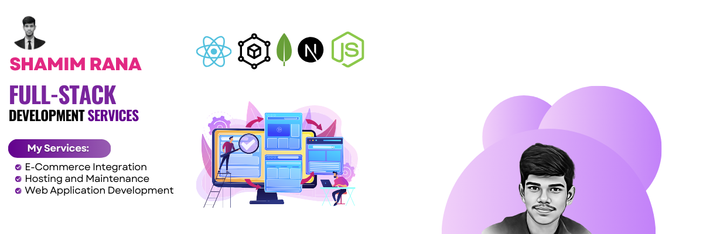

  

###

<h1>Shamim Rana</h1>

I am FullStack web developer learning since 2017

###

  
  
  

###

###

  
  

# About Me

Hi there! 👋 I'm a passionate Full Stack Developer specializing in building scalable web applications. I love solving complex problems and delivering impactful user experiences. Currently, I am exploring advanced features in **Next.js** and working on exciting projects like a **tourism website**.

# Skills :

  
  
  
  
  
  
  
  
  
  
  

###
